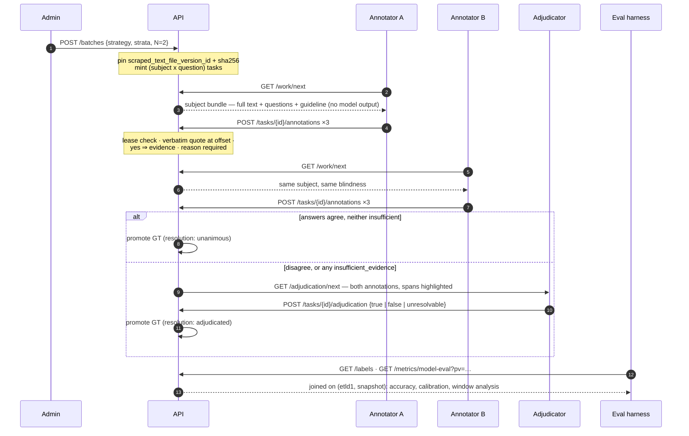
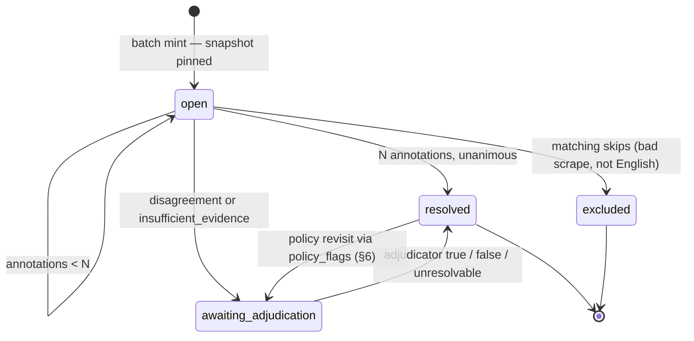

# Binary ground truth, rebuilt — design proposal

**2026-08-12 · branch `new-ground-truth` · status: PROPOSAL, nothing built. §7's five verdicts gate implementation.**

A redesign of ground-truth collection for the three binary classification questions
(`is_manufacturer`, `is_product_manufacturer`, `is_contract_manufacturer`): blind human
annotation over the pinned text snapshot, verbatim located evidence, adjudicated finals —
and an identity key that survives every catalog bump.

**TL;DR.** The current `binary_ground_truths` collection cannot produce truth: it shows the
annotator the LLM's answer before they decide, keys the label to `prompt_version_id` (so
every publish orphans it), and falls back to the model's own output as `final_decision` —
making the calibration measurement it exists for circular. The proposal: ground truth is
keyed to **(subject, question, text-snapshot version)** and nothing else. Humans annotate
*blind*, over the full scraped text, with a three-way answer, required reasons, and verbatim
evidence quotes validated server-side with character offsets. Two annotations that agree
auto-promote; anything else is adjudicated. Model output never touches the truth-making
path — it joins only at eval time, on the snapshot key. Offsets on evidence make the
deferred chunk-truncation cost a measurable number for free.

---

## §1 · Diagnosis: why the current collection can't produce truth

Every defect below is the same class of mistake this pipeline has already paid to learn
about elsewhere — the collection just predates the lessons.

| Defect | Where | The lesson it violates |
|---|---|---|
| **The anchor is baked in.** The template endpoint pre-fills `new_human_decision` with the LLM's answer and reason; the help text says a reason is optional if you agree with the LLM. | `api/routes/ground_truth/binary_ground_truth.py`, template + help text | Anchor bias — the same reason screening's candidate is never handed to grounding. A pre-filled answer collects *agreement with the anchor*, not truth; "reason optional if you agree" is rubber-stamping as a feature. |
| **Truth is keyed to the model run.** The unique index includes `metadata.prompt_version_id`. | `binary_gt_unique_idx` | On 2026-08-11 alone, seven catalogs bumped versions. Under this key every publish orphans all ground truth. GT is a property of (subject, question, evidence) — model identity belongs in the eval join, never in the truth key. |
| **`final_decision` falls back to the model.** With zero corrections, the computed field returns `extraction_stats.result` — the LLM's own answer becomes "ground truth". | `BinaryGroundTruth.final_decision` | Locked decision #28 keeps `confidence` precisely so it can be calibrated against `final_decision`. Calibrating a model against its own fallback output is circular by construction. |
| **Truth about chunk 0 only.** Stores `chunk_text` for the first chunk; the model's compiled answer uses all chunks. | `chunk_bounds` / `chunk_text` | The subject's truth lives in the whole text. With ~16% of the tail already dropped at `max_chunks=2`, chunk-0-only GT can't even see the truncation question, let alone measure it. |
| **The client echoes the document.** POST `/correction` round-trips the entire GT doc through the client; concurrency is checked by comparing the echoed `corrections` list. | POST `/correction` | The echo-surface audit's core finding: never trust a copy that traveled through another party. Server owns state; clients submit deltas. |
| **Missing machinery.** No sampling record, no blinding, no second annotator, no adjudication, no "can't tell" option, no evidence quotes, no versioned guidelines, no agreement stats. | — | Without these, no number computed from the labels is defensible — the working style here is measure, don't assert. |

## §2 · Eight principles, each traceable

| # | Principle | Traceable to |
|---|---|---|
| P1 | **Truth is keyed to evidence, not to models.** GT identity is `(mfg_etld1, classification_type, scraped_text_file_version_id)`. A re-scrape mints new tasks; a prompt publish changes nothing. | the `pv=` identity discipline, applied in reverse |
| P2 | **Blind first, reconcile later.** Annotator endpoints serve response models that *do not have* model-output fields. Blinding is enforced by the type, not by frontend discipline. | anchor-bias rejection; "wire type carries a guarantee" |
| P3 | **No fallback truth.** A GT document exists only when humans made it. The answer vocabulary is three-way — `yes \| no \| insufficient_evidence` — and `unresolvable` is a legal final. | decisions #33/#34: never force a branch the evidence doesn't support |
| P4 | **Evidence is verbatim and located.** A *yes* requires ≥1 quote, validated server-side as an exact substring of the snapshot, stored with character offsets. Humans meet the same standard decision #5 imposes on the model. | verbatim-substring hard-reject, symmetric |
| P5 | **Every "no" has a reason.** `reason` is required on every answer. ~45% of screening rejections once carried no recorded reason; that defect earned `no_candidate.explanation`. Same rule for humans. | decision #34 |
| P6 | **Policy is shared and versioned.** Guidelines encode the same locked policy the catalogs encode (repair shops out, ODM is both), in human language, versioned like catalogs. Boundary cases carry `policy_flags` so a policy revisit re-adjudicates a slice instead of re-collecting. | decisions #26/#27; #26 is explicitly "revisitable" |
| P7 | **Sampling is recorded.** Every task records its batch, strategy, and stratum. Headline accuracy is computed on the random stratum only; targeted strata oversample hard cases on purpose and would bias it. | measure-don't-assert; these numbers get reported |
| P8 | **Server owns state, clients submit deltas.** Tasks are leased, annotations are append-only, promotion happens server-side. Nothing round-trips a document through a client. | echo surfaces audit |

## §3 · Data model: three collections and a guideline pin

The annotation surface is the **full scraped text** at the pinned S3 version — not the
model's chunk window. Offsets let eval down-scope any judgment to the window the model saw;
the reverse is impossible (§6). All three questions about a subject share one snapshot, so
one reading answers all three.

### `BinaryAnnotationTask` — collection `binary_annotation_tasks`

One unit of wanted truth: a (subject, question) pair over a pinned snapshot.

```python
class BinaryAnnotationTask(Document):
    # identity — unique together; the same triple keys the GT doc
    mfg_etld1: SubjectUniqueIDType
    classification_type: BinaryClassificationTypeEnum
    scraped_text_file_version_id: S3FileVersionIDType

    # snapshot witness — computed at mint, re-verified at serve time
    text_sha256: str
    text_char_len: int

    # sampling record (P7) — NEVER serialized on annotator responses (P2)
    batch_id: PydanticObjectId
    sampling: SamplingRecord          # {strategy, stratum, model_run_ref | None}

    required_annotations: int = 2     # N distinct annotators before promotion
    status: TaskStatus                # open | awaiting_adjudication | resolved | excluded
    leases: list[TaskLease]           # {annotator_email, expires_at} — TTL ~2h
    skip_events: list[SkipEvent]      # {annotator_email, reason_code, note, at}
```

### `BinaryAnnotation` — collection `binary_annotations`, append-only

One human's independent judgment. Never edited; a correction is a new annotation with
`supersedes` set.

```python
class BinaryAnnotation(Document):
    task_id: PydanticObjectId
    # identity triple denormalized for direct joins
    mfg_etld1: SubjectUniqueIDType
    classification_type: BinaryClassificationTypeEnum
    scraped_text_file_version_id: S3FileVersionIDType

    annotator_email: str
    answer: Literal["yes", "no", "insufficient_evidence"]
    evidence: list[EvidenceQuote]     # {quote, start, end} — verbatim-validated (P4)
    reason: str                       # required, non-empty, always (P5)
    policy_flags: list[str]           # controlled vocab pinned by guideline_version (P6)

    guideline_version: str            # e.g. "is_manufacturer.gt.2026.08.1"
    started_at: datetime
    submitted_at: datetime            # seconds_spent derivable; kept raw
    supersedes: PydanticObjectId | None = None
```

### `BinaryGroundTruth` v2 — collection `binary_ground_truths` (wipe & replace)

The promoted final. No computed fallback — if no humans resolved it, the document does not
exist.

```python
class BinaryGroundTruth(Document):
    # identity — unique; joins to any model run over the same snapshot
    mfg_etld1: SubjectUniqueIDType
    classification_type: BinaryClassificationTypeEnum
    scraped_text_file_version_id: S3FileVersionIDType

    final_decision: Literal["true", "false", "unresolvable"]
    resolution: Literal["unanimous", "adjudicated", "provisional"]
    contributing_annotation_ids: list[PydanticObjectId]
    adjudication: Adjudication | None      # {adjudicator_email, reason, at}
    evidence: list[EvidenceQuote]          # promoted quotes, offsets intact
    policy_flags: list[str]                # union over contributors
    resolution_log: list[ResolutionEvent]  # append-only history of re-adjudications
```

### Guidelines: git-tracked, pinned, human-language

One markdown file per question under `knowledge/ground_truth/guidelines/`, versioned like
catalogs (`is_manufacturer.gt.2026.08.1`) with a sha pin. They restate the *locked policy
decisions* — repair/refurbish shops are not manufacturers (#26), an ODM is both product and
contract manufacturer (#27), aspirational work doesn't count (MFG-G1's substance) — in plain
language, with the controlled `policy_flags` vocabulary defined alongside. They deliberately
do **not** reproduce catalog rule text or ids: the human and the model must share the
*policy*, not the rubric — otherwise "independent agreement" is an illusion and eval
measures rubric-following, not correctness. Every annotation records the guideline version
it was made under.

## §4 · APIs: four planes, blinding enforced by type

All under `/gt/binary/`, replacing the two current routes. The annotator plane's response
models physically lack model-output and sampling fields — a frontend cannot leak what the
API never serialized.

### Annotator plane (blind)

| Endpoint | Behavior |
|---|---|
| `GET /work/next` | Leases the next subject bundle for this annotator: `{mfg_etld1, text, text_sha256, tasks: [{task_id, classification_type, question, guideline_md, guideline_version}]}`. Excludes tasks this annotator already answered; text downloaded by pinned S3 version and sha-verified against the mint-time witness. One reading serves up to three questions. |
| `POST /tasks/{id}/annotations` | Body: `{answer, evidence: [{quote, start?}], reason, policy_flags, guideline_version, started_at}`. Server validates: live lease · quote is an exact substring at `start` (offset omitted → server locates it; ambiguous match without offset → 422) · *yes* ⇒ ≥1 quote · `reason` non-empty · annotator hasn't already answered this task. On reaching `required_annotations`: unanimous → GT promoted; else → `awaiting_adjudication`. |
| `POST /tasks/{id}/skip` | `{reason_code: bad_scrape \| not_english \| site_error \| other, note}`. Two independent skips with the same code → task `excluded`. Exclusions are a data-quality signal for the scraper, not discarded noise. |

### Adjudicator plane

| Endpoint | Behavior |
|---|---|
| `GET /adjudication/next` | Text plus the collected annotations side by side, evidence spans highlighted at their offsets. **Model output is absent here too** — the truth-making path never consults the model, at any step. |
| `POST /tasks/{id}/adjudication` | `{final: true \| false \| unresolvable, reason, promoted_evidence_ids}`. Writes the GT document, `resolution: adjudicated`. |

### Admin plane

| Endpoint | Behavior |
|---|---|
| `POST /batches` | `{strategy, strata: [{name, filter, n}], required_annotations}`. Server resolves subjects, pins each one's *current* `scraped_text_file_version_id`, computes `text_sha256`, mints (subject × question) tasks. Stratum filters may read model runs — recorded on the task, never served to annotators. |
| `GET /batches/{id}` | Progress: tasks by status, per-stratum coverage, annotator throughput. |

### Consumer plane

| Endpoint | Behavior |
|---|---|
| `GET /labels` | Bulk export filtered by `classification_type` / `resolution`, keyed by the identity triple — the join handle for any eval harness. |
| `GET /metrics/agreement` | Cohen's κ per question, per-annotator confusion vs finals, `insufficient_evidence` rates, median seconds per task. |
| `GET /metrics/model-eval` | Given a run selector (`pv=` / catalog_version): accuracy & confusion vs GT joined on (etld1, snapshot version) — random stratum only for headline numbers · confidence calibration curve (decision #28's promised measurement) · **evidence-window analysis**: of model-vs-GT disagreements, the fraction whose human evidence lies entirely beyond the `max_chunks` window. |

### Suggested initial strata

- `random` — uniform over scraped subjects. The unbiased backbone; the only stratum headline
  metrics are computed on.
- `low_confidence` — any question with model confidence ≤ 60 (calibration needs coverage
  where the model hedges — e.g. the is_product_manufacturer 95→40 shift).
- `chunk_split` — chunks disagreed on the answer before compilation (the union-risk class).
- `guard_decided` — runs where a guard (MFG-G2, CON/PRD guards) determined the verdict:
  policy-boundary coverage feeding P6.

## §5 · Workflow: the human loop, end to end



Model output appears nowhere left of the Eval lane. That is the whole design.

### What the annotator sees

One screen per subject: the pinned text on the left, the current question on the right.
Selecting text in the reading pane mints an evidence chip with its offsets — quoting is a
gesture, not typing, which is what makes P4's verbatim rule free instead of annoying. The
three questions step in fixed order; a subject is one sitting.

```
┌───────────────────────────────────────────┬─────────────────────────────────────┐
│ anchor-mfg.com                            │ QUESTION 1 OF 3 · is_manufacturer   │
│ snapshot v: 9320z7…aiCO · sha ✓ · 41,208  │ Does this business itself carry out │
│                                           │ production of tangible goods?       │
│ …Anchor Manufacturing serves the          │                                     │
│ automotive industry with a full range of  │ [ YES ]   [ no ]   [ can't tell ]   │
│ metal stamping capabilities.              │                                     │
│ ▐We operate 14 progressive stamping       │ EVIDENCE — select text to quote     │
│ ▐presses from 60 to 600 tons▌, producing  │ ▸ "We operate 14 progressive        │
│ precision components for Class 8 truck    │    stamping presses…"  · 1204:1257  │
│ and school bus platforms. Our in-house    │                                     │
│ tool room supports die design, build,     │ REASON (required)                   │
│ and maintenance. Certifications include   │ Operates its own presses and tool   │
│ IATF 16949 and ISO 14001, available for   │ room; production is theirs…         │
│ download on our supplier portal…          │                                     │
│                                           │ POLICY FLAGS                        │
│                                           │ (repair_shop_boundary)              │
│                                           │ (odm_boundary✓) (aspirational_only) │
│                                           │                                     │
│                                           │ [ Submit & next question ]          │
│                                           │ guideline …gt.2026.08.1 · skip      │
└───────────────────────────────────────────┴─────────────────────────────────────┘
```

### Task lifecycle



`resolved` covers unanimous, adjudicated, and provisional finals; `unresolvable` is a
resolved outcome, not a dead letter.

## §6 · Payoff: what this lets you measure

- **Accuracy, precision/recall, confusion per question** — on the random stratum for
  unbiased headline numbers; per-stratum for the hard-case slices.
- **Confidence calibration** — the measurement decision #28 kept `confidence` alive for,
  now against genuinely human finals. "Delete it only if measured flat" becomes executable.
- **The truncation price** — evidence offsets vs the model's `max_chunks` window boundary
  classify every disagreement as *model missed it* vs *model never saw it*. The deferred
  ~16% tail question stops being a shrug and becomes a rate.
- **Cheap policy revisits** — flip decision #26 on repair shops later, query
  `policy_flags: repair_shop_boundary`, re-adjudicate that slice. No re-annotation; the
  `resolution_log` keeps both eras auditable.
- **Annotation quality itself** — κ per question (expect is_contract_manufacturer lowest;
  ODM and spec-work nuance live there), per-annotator drift, guideline versions correlated
  with disagreement spikes (a guideline edit that moves κ is a real finding).
- **Cross-prompt comparisons that stay honest** — because GT is snapshot-keyed, every past
  and future run over the same scrape joins to the same labels; catalog bumps re-dispatch
  requests but never invalidate truth.

## §7 · Forks: five verdicts needed — recommendations attached

1. **The old `binary_ground_truths` collection.** Migrate, or archive-and-wipe?
   **Recommend: archive a JSON dump, wipe.** The labels are anchored (pre-filled answers),
   pv-keyed, and fallback-poisoned — they are model echoes, not truth. Consistent with this
   branch's wipe-and-re-run posture.
2. **`required_annotations` at launch.** Two annotators from day one, or one while it's
   just you? **Recommend: model supports N from day one; batches default to 1 now, flip to
   2 when a second annotator exists.** Single-annotator finals are marked
   `resolution: provisional` so eval can filter or report them separately — honesty is in
   the label, not the workflow.
3. **Annotation surface.** Full scraped text, or exactly the model's chunk window?
   **Recommend: full text.** Offsets let you down-scope any judgment to the model's window
   after the fact; a window-only label can never be up-scoped. Choosing the window would
   also silently bake `max_chunks=2` — a temporary testing setting — into your truth.
4. **Guideline content.** Show annotators the catalog rules, or human-language guidelines
   encoding the same policy? **Recommend: human-language, catalog text withheld.** Sharing
   the rubric anchors humans to the model's decomposition and turns "independent agreement"
   into rubric-following. Policy must match; wording must not.
5. **Bundling.** Always all three questions per subject sitting? **Recommend: bundle by
   default** — one reading, three answers is the cheapest human-time win available. The
   sampler may still mint partial bundles (e.g. a low-confidence stratum on one question);
   the bundle endpoint just serves whatever tasks exist for the subject.

## §8 · Landing it: what changes in the codebase

- `db_models/binary_ground_truth.py` — replaced by the three documents in §3;
  `HumanBinaryDecision` / `HumanDecisionLog` / the `final_decision` computed field retire.
  `GroundTruthSource` retires with the user-form path.
- `api/routes/ground_truth/binary_ground_truth.py` — replaced by the four planes in §4. The
  concept/keyword GT routes are untouched (their redesign should follow this template
  later, but phrase-level GT has its own identity questions — out of scope here).
- `services/ground_truth/binary_ground_truth_service.py` — lookup becomes the identity
  triple. Callers to update: `new_extract_queue_bot.py:321`, `gt_extract_queue_bot.py:315`,
  and `scraped_mfg_file_util.py` — each should query by the snapshot version it is actually
  processing.
- `db_seed_indices.py` — `create_binary_ground_truth_indexes` re-pointed at the triple; new
  unique index on tasks' triple, and on annotations `(task_id, annotator_email)`
  unique-where-not-superseded.
- `scripts/generate_db_schemas.py` — regeneration of the three new schemas (owner-run
  workflow, as with the `IterativeTaggingRequest` fields).
- **Reuse:** annotator identity is the existing `User` registration plus an adjudicator
  role; quote validation shares one util with the decision #5 verbatim-substring check;
  text serving goes through `download_scraped_text_from_s3_by_subject_unique_id` with the
  pinned version id, sha-verified against the mint-time witness on every serve.

---

*Sources: the locked-decision record, the 2026-08-11/12 eval verdicts, and the
echo-surface / phrase-identity audits on branch `new-ground-truth`.*
