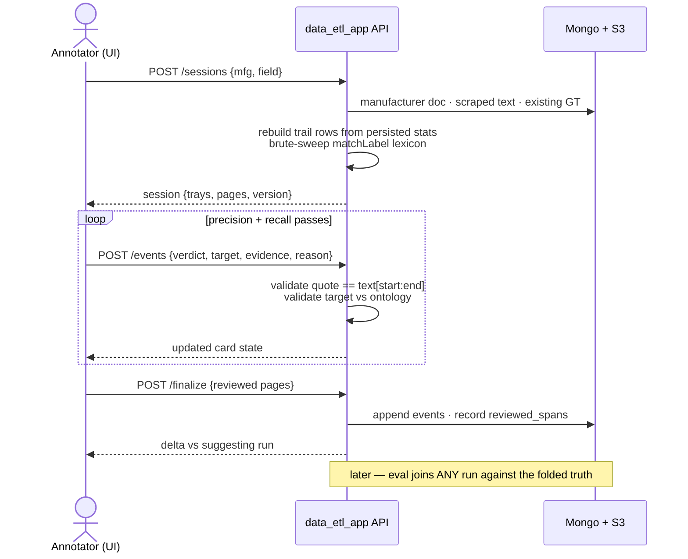

# Ground truth for concept entity extraction — design proposal

**Status:** proposal, 2026-08-12 · branch `new-ground-truth` · replaces the legacy
`ConceptGroundTruth` model (`db_models/concept_ground_truth.py`;
`concept_ground_truth_new.py` is currently a verbatim copy of it — the blank
slate this design fills).

**Scope:** the four concept fields — `industries`, `conformity_attestations`,
`material_caps`, `process_caps`. Assumes a frontend that can render whatever UI
the APIs below support.

**One sentence:** human annotations are anchored to the scraped text and the
ontology — not to any run — so one ground truth survives prompt, chunking, and
ontology churn, and every deferred "ground-truth question" becomes a
measurement.

---

## §1 What the ground truth must answer

Every recent evaluation ended with questions explicitly deferred to ground
truth. They are the requirements list:

- **Recall cost of precision work.** The search-prompt restraint measurably
  dropped junk, but also cost real entities (salt spray chamber, orbital
  riveting machine). Is the trade net-positive? Unanswerable without a
  reference set.
- **Granularity.** Is "Automotive" or "Automotive Components" the right depth?
  Did losing "Low Alloy Steel" matter? The pipeline's deepest-tag semantics
  need a truth with explicit depth.
- **Mapping false positives.** The IGR-M2 axis-mismatch class (High Strength
  Steel → High Alloy Steel, welded assemblies → Braze Welding) needs labeled
  wrong-mappings with the *corrected* target, so prompt fixes have regression
  fixtures.
- **Chunk-union disagreements.** When two chunks disagree and the union keeps
  the bad answer, only per-chunk-derivable truth can attribute the error.
- **Ontology gap detection.** "Welding" and "Tooling" persisting as
  out-of-vocab are missing-node signals; confirmed OOV annotations are the
  evidence for ontology additions.

Binary classification already has this: `BinaryGroundTruth.final_decision`
made confidence calibration measurable. Concept extraction — the multi-stage
pipeline — is the gap.

## §2 Why the current model cannot carry it

The existing `ConceptGroundTruth` predates the multi-stage refactor and is
structurally coupled to a single run:

1. **Legacy stage types.** Corrections upsert `RawLLMMappingResult` /
   `LLMSearchResults` — shapes the pipeline no longer produces. There is no
   place to record a verdict on a screening rule, a grounding choice, or an
   OOV proposal.
2. **Keyed to the run, not the text.** The unique index includes
   `chunk_bounds`, and the document freezes a copy of one run's
   `extraction_stats`. The planned asymmetric-chunking change alone would
   orphan every document; a prompt edit already makes the frozen copy
   unrepresentative.
3. **Corrections as annotated copies.** Verdicts are string prefixes
   (`"Yes — "`, `"Correct, "`) spliced into value strings — unqueryable,
   unvalidatable, and the same two-channels-encoding-one-fact defect the
   wire-schema work just eliminated on the pipeline side.
4. **Postman-shaped flow.** The template round-trip with a field-by-field
   tamper check exists because there was no frontend. With one, the draft
   belongs server-side.

## §3 Core decision: truth is a set of evidence-anchored assertions on the text

The durable unit is a **concept assertion**: *this text, at this scraped-text
version, supports (or does not support) this concept for this manufacturer* —
with verbatim evidence spans. The ground-truth document for a
`(subject, scraped_text_file_version_id, field_type)` triple is the set of
adjudicated assertions plus a record of which character ranges a human
actually reviewed.

> **The load-bearing property:** nothing in the key or the assertions
> references chunk bounds, prompt versions, or run artifacts. Evidence spans
> are absolute character offsets into the scraped text, so per-chunk truth for
> *any* chunking is derivable by intersecting spans with chunk bounds. The
> same document scores today's 5k-token chunks and next quarter's asymmetric
> windows.

Three subordinate commitments follow:

- **Verbatim evidence, enforced.** `quote == scraped_text[start:end]` is
  validated on write — the same hard-reject discipline the pipeline applies to
  LLM evidence quotes. Human spans come from text selection, so this costs
  nothing.
- **Explicit negatives.** A rejected candidate is stored, with an optional
  reason. A truth that is only a positive set cannot distinguish "judged
  absent" from "never considered" — and the review workflow considers hundreds
  of candidates per session, so the considered set is real information.
- **Depth is part of the claim.** An assertion names the *deepest concept the
  evidence supports*; ancestors are implied by the ontology. Scoring can then
  award exact or ancestor credit, which is precisely the
  Automotive / Automotive Components question.

### The rule catalog is the annotation codebook

The measured junk taxonomy (entity not identifiable, relationship merely
named, wrong party, aspirational, axis-mismatch mapping, wrong granularity)
already exists as versioned, worded rules: SCR-\*, IGR-\*, RGR-\*. Rejection
reasons are therefore an *optional* pick from the catalog's rule ids plus free
text — never a forced full report. That makes human labels directly joinable
to the model's `applied_rules` for per-rule agreement analysis, at zero added
schema cost, with `catalog_version` recording which wording the annotator saw.

## §4 Data model

| Piece | Shape | Notes |
|---|---|---|
| `ConceptGroundTruthDoc` | `(subject, text_version, field_type)` | Unique key. Ontology version is *provenance on assertions*, not part of the key — see §8. |
| `AssertionTarget` | `in_vocab(uri, name) \| oov(label)` | Tagged union — the wire-schema lesson: parallel nullable channels that can disagree are banned. OOV labels canonicalized through the existing out-of-vocab label service. |
| `EvidenceSpan` | `{start, end, quote}` | Absolute offsets into the scraped text version; quote verbatim, validated server-side. |
| `AssertionEvent` | append-only log entry | verdict (`confirmed` / `rejected` / `uncertain`), target, evidence, optional reason `{rule_id, note}`, author, source, and `candidate_ref` — the provenance of what prompted the judgment. |
| `candidate_ref` | origin + run pin | origin ∈ `pipeline_grounded \| pipeline_oov \| pipeline_rejected \| brute_sweep \| human_added`; run pin = the suggesting run's metadata (prompt versions, catalog versions, chunking). This is how stage-level verdicts are captured *incidentally* — no separate stage-labeling pass, ever. |
| `reviewed_spans` | `list[{start, end}]` | Character ranges the annotator actually read. Recall metrics only score inside them — with `max_chunks=2` truncation, ~16% of text was never extracted and must not silently count against either side. |

```python
class EvidenceSpan(BaseModel):
    start: int
    end: int
    quote: str                     # == scraped_text[start:end], hard-validated

class InVocabTarget(BaseModel):
    kind: Literal["in_vocab"]
    concept_uri: str               # survives label edits; name denormalized for display
    concept_name: str

class OOVTarget(BaseModel):
    kind: Literal["oov"]
    label: str                     # canonicalized via out_of_vocab_labels_service

class AssertionReason(BaseModel):
    rule_id: str | None            # from the catalog the annotator was shown
    catalog_version: str | None
    note: str | None

class AssertionEvent(BaseModel):
    event_id: str
    target: InVocabTarget | OOVTarget          # discriminated on `kind`
    verdict: Literal["confirmed", "rejected", "uncertain"]
    evidence: list[EvidenceSpan]               # required when confirmed
    corrected_from: InVocabTarget | OOVTarget | None   # M2-class fixtures
    reason: AssertionReason | None
    candidate_ref: CandidateRef                # origin + suggesting-run pin
    author_email: str
    source: GroundTruthSource                  # reused enum
    created_at: datetime

class ConceptGroundTruthDoc(Document):
    subject_unique_id: SubjectUniqueIDType
    scraped_text_file_version_id: S3FileVersionIDType
    field_type: ConceptTypeEnum
    reviewed_spans: list[ReviewedSpan]
    events: list[AssertionEvent]               # append-only
    # final truth = fold(events): latest verdict per (author, target),
    # adjudication precedence across authors — BinaryGroundTruth pattern.
```

The fold mirrors `BinaryGroundTruth.final_decision`: nothing is overwritten,
the current truth is computed. `corrected_from` is what turns every
wrong-mapping rejection into a prompt-regression fixture: the run said High
Alloy Steel, the human moved it to Low Alloy Steel, and both ends are
recorded.

## §5 The collection workflow

Annotation is **review-first**: the pipeline's own trail — every phrase it
searched, screened, grounded, or rejected, rebuildable from persisted
`ConceptExtractionStats` via the trail-row builder (no disk dumps needed) — is
the scaffold that makes each judgment a five-second keyboard action instead of
a from-scratch reading task. The truth produced is still independent of that
scaffold: what gets stored is the assertion and its evidence, with the
scaffold demoted to provenance.

1. **Pick work — the queue.** A worklist of `(subject, field)` pairs,
   prioritized by concept-coverage gaps (the existing coverage endpoint's
   logic), run-vs-run disagreement, and incident subjects. Unknown
   manufacturers keep today's behavior: enqueue a scrape, come back later.
2. **Session assembly — server-side.** Opening a session builds the working
   set once: scraped text from S3, candidate trays derived from the subject's
   persisted extraction results, any existing GT doc folded in, plus a
   **brute-sweep** — the full matchLabel lexicon and known OOV labels run over
   the whole text — to surface mentions the LLM path never produced. The draft
   lives in Mongo with a version stamp; the tamper-check round-trip is gone.
3. **Precision pass — dispose of every candidate.** The annotator walks the
   candidate trays: confirm, reject-with-reason, move depth, or fix the
   mapping. Every card demands a disposition; "uncertain" is a first-class
   verdict, not an excuse to skip.
4. **Recall pass — read and add.** Page through the text with all claimed
   spans highlighted. Unclaimed brute-sweep mentions are pre-marked for
   triage; anything else the annotator selects by hand, then binds to a
   concept via ontology autocomplete/tree or mints as OOV.
5. **Finalize.** Blocks until every candidate in the reviewed range is
   disposed. Records `reviewed_spans`, appends the session's events, shows the
   delta against the suggesting run (confirmed / rejected / added / moved) as
   a sanity check before commit.

### The review screen

```
┌──────────────────────────────────────────────────────────────────────────────┐
│ anchor-mfg.com · material_caps    [Concepts 14] [OOV 3]                      │
│                                   [Pipeline-rejected 41] [Brute sweep 6]     │
│                                                    39/64 disposed ▓▓▓▓▓░░░   │
├───────────────────────────────────┬──────────────────────────────────────────┤
│ SCRAPED TEXT · chars 0–5,000  1/5 │ ┌ Stainless Steel        [confirmed] ┐   │
│                                   │ │ 2 phrases · grounded r1 · IGR-M1   │   │
│ …Anchor produces precision        │ └────────────────────────────────────┘   │
│ components from ▒stainless        │ ╔ High Alloy Steel      [wrong node?] ╗  │
│ steel▒, carbon steel, and         │ ║ "advanced high strength steel"      ║  │
│ █advanced high strength steel█    │ ║ IGR-M2 "generalizes" · axis:        ║  │
│ for structural applications…      │ ║ performance vs composition          ║  │
│                                   │ ║ [✓ confirm][✗ reject][↳ re-map][ev] ║  │
│ …LS Series doors provide tough    │ ╚═════════════════════════════════════╝  │
│ d̶e̶f̶e̶n̶s̶e̶ against harsh weather,    │ ┌ Defense                [rejected] ┐   │
│ with optional ▒aluminum▒ trim…    │ │ reason SCR-2 · word-association    │   │
│                                   │ └────────────────────────────────────┘   │
│ …complex ▒welded assemblies▒      │ ┌ Welding                    [OOV]  ┐    │
│ delivered ready for integration…  │ │ no node at this level · gap signal │    │
│                                   │ └────────────────────────────────────┘   │
├───────────────────────────────────┴──────────────────────────────────────────┤
│ RE-MAP · ontology path — ← shallower · → deeper · ⏎ place here               │
│   Metal › Steel › ┃Low Alloy Steel┃ › (HSLA Steel) (…4 children)             │
│ REASON (optional — quick-pick from catalog v. mc-igr-7)                      │
│   [IGR-M2*] [IGR-Q2] [SCR-2] [granularity] [+ note…]                         │
├──────────────────────────────────────────────────────────────────────────────┤
│  Y confirm · N reject · M re-map · U uncertain · J/K next/prev · E evidence  │
└──────────────────────────────────────────────────────────────────────────────┘
```

Left: scraped text with the selected candidate's evidence highlighted (█),
other claimed spans underlaid (▒), rejected spans struck. Right: candidate
cards grouped by target concept, each carrying its trail context (search
round, grounding rule) as one line — expandable to the full rule report when
the annotator wants the model's reasoning. Bottom drawer: the depth slider
over the real ontology path, and the catalog-rule reason picker. The selected
card is the measured IGR-M2 case — the annotator rejects High Alloy Steel and
re-maps to Low Alloy Steel; both ends persist via `corrected_from`.

### Candidate trays, precisely

| Tray | Built from | Typical disposition |
|---|---|---|
| **Concepts** | Run's `results.in_vocab`, grouped by final concept with contributing phrases, relationship summaries, and rule reports | Confirm; occasionally move depth or re-map |
| **OOV proposals** | Run's `results.out_of_vocab` | Confirm as true OOV (ontology-gap evidence), bind to an existing concept, or reject |
| **Pipeline-rejected** | Trail rows with status `screened_out` / `no_match` | Fast confirm-reject sweep; occasional rescue = a recall bug caught |
| **Brute sweep** | Full matchLabel lexicon + known OOV labels over the text, minus spans already claimed | Triage; catches what LLM search never emitted |

### Cost, measured

Observed row counts: steelcraft industries 47 trail rows over two chunks;
anchor-mfg 769 phrases across seven fields. Expect **50–150 candidates per
subject × field**. At keyboard pace (5–10 s per card, most being one
keystroke), the precision pass is 15–30 minutes and the recall pass ~10; the
four concept fields land near **two hours per subject**. The trays are what
make this tractable — the pipeline-rejected sweep is fast precisely because
most rejections are obviously right, and that fact itself becomes recorded
precision data.

## §6 APIs

| Endpoint | Purpose |
|---|---|
| `POST /gt/concepts/sessions` | Create or resume a session for `{mfg_url, field_type}`. Assembles working set; enqueues scrape for unknown subjects (existing behavior). Returns session id + version stamp. |
| `GET /gt/concepts/sessions/{id}` | Progress summary: tray counts by disposition, reviewed pages, suggesting-run pin. |
| `GET …/{id}/text?page=` | Stable text window with span decorations for every candidate/assertion in range. |
| `GET …/{id}/candidates?tray=&status=` | Candidate cards with trail context and stable candidate ids. |
| `POST …/{id}/events` | The single write: verdict + target + evidence + optional reason, referencing a candidate or free-added. Validates verbatim quotes and target existence; idempotent by event id. |
| `GET /ontology/{field}/search?q=` | Autocomplete over prefLabel / altLabels / matchLabels (existing ontology service). |
| `GET /ontology/{field}/{concept}/context` | Path-to-root + children — feeds the depth slider. |
| `POST …/{id}/finalize` | Validates full disposal in reviewed range; records `reviewed_spans`; appends events to the GT doc; returns the run delta. |
| `GET /gt/concepts/{mfg}/{field}` | Folded current truth — the eval consumer. |
| `GET /gt/concepts/queue` | Prioritized worklist (coverage gaps, run disagreement, incidents). Phase 2. |



## §7 Scoring — what the truth unlocks

An eval takes any run's `ConceptExtractionResults` and a GT doc on the same
`(subject, text_version, field)`:

- **Final-set metrics.** Precision / recall / F1 of `results.in_vocab`
  against confirmed assertions — exact, and with ancestor credit (a
  prediction that is an ancestor of the true node scores partial,
  distance-discounted). OOV matched by canonical label through the existing
  dedupe utilities. Scored only inside `reviewed_spans` ∩ the run's extracted
  ranges.
- **Per-chunk truth on demand.** Intersect evidence spans with any chunking's
  bounds — chunk-union disagreements become attributable, under today's
  chunking or any future one.
- **Stage attribution for misses.** Join a false negative's evidence span
  back to the run's trail by phrase (exact, then the scored best-first matcher
  already designed for the reconciler): was it never searched, screened out,
  sentinel-stopped, or mapped elsewhere? Each miss lands on a stage — the
  number that decides where the next prompt iteration goes.
- **Per-rule agreement.** Where annotators picked rule ids, human reasons
  join to the model's `applied_rules` — a confusion matrix per catalog rule,
  per `catalog_version`.
- **Fixture export.** Every `corrected_from` pair is a ready-made regression
  case for the M2-class prompt work.

## §8 Lifecycle — churn the design must survive

**Ontology bumps.** Assertions store concept URIs with ontology version as
provenance; the doc key excludes it. On a bump, a revalidation sweep flags
assertions whose URI vanished (*needs_remap* queue) and — the productive
direction — matches new concepts' labels against confirmed OOV assertions,
proposing conversions for one-keystroke confirmation. The Welding case is the
worked example: today's confirmed OOV "Welding" assertions become in-vocab
assertions the day the node lands, instead of dying with a version-keyed
document.

**Re-scrapes.** A new text version is a new GT doc — offsets don't transfer.
A carry-forward assist re-locates each assertion's quotes in the new text
(exact, then normalized match) and pre-fills a session for confirmation, so
re-annotation is a review, not a restart.

**Multiple annotators.** Events already carry authors; the fold takes the
latest verdict per (author, target), and a conflict — differing latest
verdicts across authors — surfaces in an adjudication view rather than being
silently last-write-wins. Inter-annotator agreement is computable from the
event log with no extra collection. Phase 3; the model needs nothing changed
for it.

## §9 Build order

1. **Truth + collection core.** New models in `concept_ground_truth_new.py`;
   session/candidates/events/finalize endpoints; trail-row rebuild from
   persisted stats; verbatim-span validation; single annotator. Eval as a
   script producing final-set metrics — enough to answer the granularity and
   recall-cost questions on the current baselines.
2. **Recall + attribution.** Brute-sweep tray; stage-attribution join in the
   eval; queue endpoint with coverage/disagreement priorities; ontology-bump
   revalidation sweep.
3. **Scale-out.** Adjudication view, IAA reporting, carry-forward on
   re-scrape, fixture export for prompt regression suites.

## §10 Open forks (decisions that are yours)

1. **Key by text version, dropping chunk bounds and prompt versions from
   identity?** → *Recommend yes.* It contradicts the existing model's index,
   but that model is legacy, and chunk-keyed truth dies on the
   asymmetric-chunking change already on the roadmap. Span-anchoring keeps
   per-chunk views derivable.
2. **Explicit negatives with catalog-rule reasons?** → *Recommend yes.* Store
   every rejection; keep the rule id optional (quick-pick, never a forced
   report). Costless during review, and it is what makes per-rule agreement
   and the precision denominator real.
3. **Ontology version out of the key, with revalidation sweeps?** →
   *Recommend yes.* Truth about the text outlives vocabulary revisions; the
   sweep makes bumps productive (OOV→in-vocab conversion) instead of
   destructive. The alternative — per-version GT docs — forks the corpus on
   every bump.
4. **Stage verdicts only as event provenance, never a separate labeling
   pass?** → *Recommend yes.* Stage attribution is computed by joining truth
   to any run's trail; storing per-stage labels would couple the corpus to
   one run's stage outputs — the exact defect being removed.
5. **How do "uncertain" verdicts score?** → *Recommend:* excluded from both
   numerator and denominator by default, reported as an abstention count.
   Alternative: score them as negatives-with-asterisk. Low stakes, but worth
   fixing before the first eval so numbers stay comparable.
6. **Do keyword fields (products, contract_products, equipments) migrate onto
   the assertion model later?** → *Recommend defer,* but design nothing that
   blocks it — an assertion with an OOV-style free-label target and no
   ontology path is exactly a keyword annotation, and the planned keyword
   ontology would slot into the same target union.
