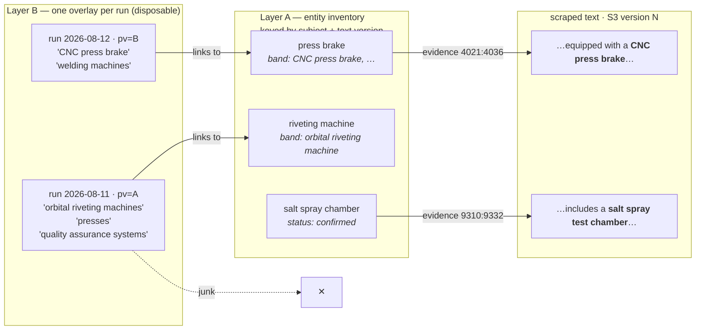
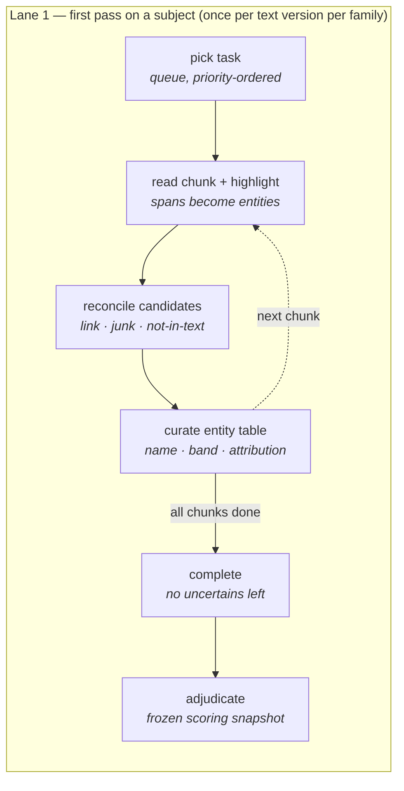
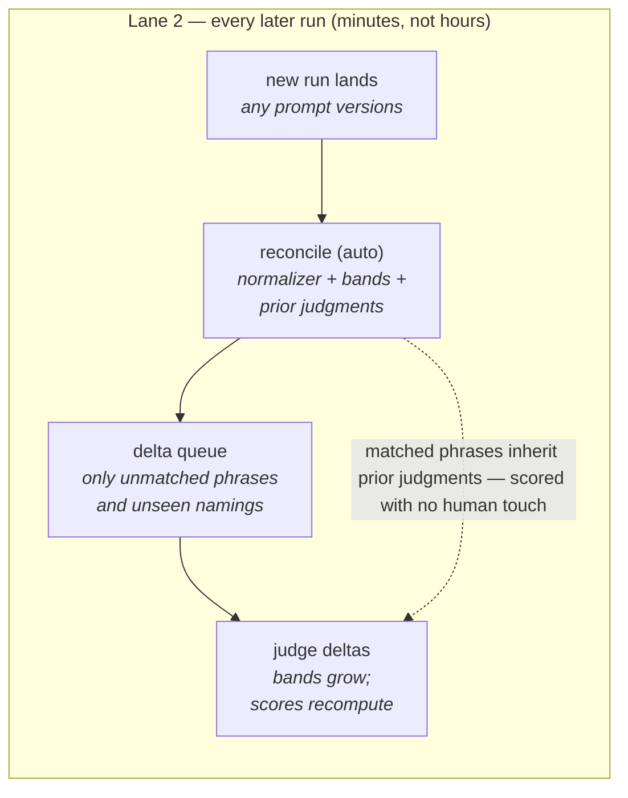

# Ground truth for keyword entity extraction — design proposal

**Status: proposal for discussion** (2026-08-12). Nothing here is implemented; the
decision forks in §8 come first. Covers the keyword fields (`products`,
`contract_products`, `equipments`); concept fields get their own instrument (§8, F4).
The binary-classification counterpart lives in [README.md](README.md).

**The essence.** Ground truth becomes an *entity inventory* anchored to a versioned
scraped text by character-offset evidence spans — not a list of corrections against
one run's output. Pipeline runs are seeds and consumers of the inventory, never part
of its identity, so a prompt edit (or the planned asymmetric re-chunking) orphans
nothing. Each entity carries an **acceptable-names band** that settles the
naming-granularity question once per naming instead of once per run, and a per-run
**audit overlay** links pipeline phrases to entities with one judgment each — from
which every per-stage metric (search recall, screening confusion, grounding naming,
product attribution) is *derived*, not separately annotated.

---

## §1 What this instrument must measure

The last three run evaluations each ended by deferring a judgment to ground truth.
Those deferrals are the requirements list:

- **Search-restraint recall cost.** The precision rework cut equipment phrases from
  50 to 22 in one run — losing *salt spray test chamber* and *orbital riveting
  machine* while gaining welding-machine granularity. Whether that trade was good is
  unanswerable without a reference set, and search is the one unrecoverable stage:
  recall lost there is lost for good.
- **Naming granularity.** Is *CNC press brake* right where a previous run said
  *press brake*? Baseline diffs flagged this repeatedly ("Low Alloy Steel dropped —
  granularity shift, watch with ground truth") and no per-run eyeballing can settle
  it durably.
- **Product attribution.** The canonical false-positive class is the customer's end
  product (*school bus*, *Class 8 truck*) landing in the own-products list, and the
  ODM decision says one output can legitimately belong to both product fields.
  Attribution needs to be a recorded human judgment, not something inferred per run.
- **Junk that survives.** Screening-survival rates understate junk because junk gets
  grounded (industry "Defense" extracted from "tough defense against harsh
  weather"). A precision measurement needs a human junk label per candidate phrase,
  not a survival proxy.

And one process requirement from how this project actually works: prompts changed
twelve times in the week this was written. Any ground truth whose identity or
meaning is coupled to a prompt version is dead on arrival.

## §2 Why the current scaffold can't carry it

The existing `KeywordGroundTruth` document, service, and routes predate the
multi-stage pipeline. Four structural problems, in increasing order of severity:

1. **It validates against a field that no longer exists.** The service checks
   additions against `extraction_stats.llm_search`; the current
   `KeywordExtractionStats` has `llm_phrase_search: dict[int, …]` keyed by round,
   plus relationship, screening, and freehand-grounding stats. The unique index path
   `metadata.search_prompt_version_id` is equally extinct.
2. **Identity includes a prompt version.** Every prompt edit silently orphans all
   collected truth — the fetch just misses. Under this project's edit cadence,
   nothing would ever accumulate.
3. **Corrections are deltas.** `add`/`remove` lists against one run's output are
   uninterpretable against any other run's output. The labor is spent on the run,
   not on the text.
4. **Chunk bounds are frozen into identity.** The deferred asymmetric-chunking work
   (2.5k search windows inside 10k macro-windows) would re-key every chunk and
   orphan everything a third way.

The salvageable parts: the append-only correction log with author identity, the
registered-user gate, the write-time validation posture (download the versioned
text, verify everything against it), and the template→correct interaction shape.
All four carry over.

## §3 The shape: an anchored inventory plus per-run overlays



*Fig. 1 — The anchoring mechanism. Runs come and go with every prompt edit; the
inventory and its spans never move. Layer B joins on the phrase string, whose
stability the sent-phrases contract already guarantees.*

### Principles

- **P1 — Ground truth is an absolute inventory, not a correction.** The stored
  artifact is the full set of true entities evidenced in the text. Pipeline output
  seeds the annotation session and is judged against the inventory, but never
  defines it. Any run — past, present, or under a future chunking strategy — is
  scorable against the same document.
- **P2 — Evidence spans are the identity primitive.** Each entity carries
  `(start, end, snippet)` offsets into the *full* versioned scraped text — not the
  chunk. Offsets are the purest invertible identity available (same instinct as the
  phrase-identity contract), and the stored snippet is the second witness: the write
  validator downloads the text by version id and rejects any span where
  `snippet != text[start:end]`.
- **P3 — An acceptable-names band settles granularity once per naming.** An entity
  has one `canonical_name` plus `acceptable_names` and `unacceptable_names` lists.
  When a new run emits a naming nobody has adjudicated, it enters a delta queue,
  gets judged once, and joins a band forever. Matching against bands reuses the
  casefold/plural normalizer in `label_dedupe_util` as the single pure matching
  function.
- **P4 — One products-family pass, attribution as a field.** Product search feeds
  both product pipelines with the identical phrase set, so the human annotates the
  family once; each entity carries
  `attribution ∈ {own_product, contract_product, both, customer_end_product, not_a_product}`
  (ODM ⇒ `both`, per locked decision #27). The `products` and `contract_products`
  reference sets are then *derived* filters — and the school-bus confusion class
  becomes directly countable. Equipments is its own pass with
  `usage ∈ {used_by_manufacturer, mentioned_only}`.
- **P5 — Per-stage verdicts are derived, never separately annotated.** The human
  makes exactly one judgment per candidate phrase: link it to an entity, or mark it
  `junk` / `not_in_text` / `uncertain`. Search recall, screening confusion, and
  grounding naming accuracy all fall out of joining those links against the trail
  rows the pipeline already dumps — nobody ever answers "was this screening verdict
  correct?" as a survey question. An optional `disputed_rule_id` on a link is the
  hook into the rule-catalog structured-feedback loop.
- **P6 — Split discipline: dev and test are marked at birth.** anchor-mfg and
  steelcraft have been prompt-tuning targets for weeks — they are `dev` by
  construction and their scores are never the headline number. Fresh subjects
  onboarded for `test` get annotated and then left out of prompt iteration. The
  `split` field is on the document, not in someone's memory.

## §4 Data model

Two Beanie documents. Field types reuse the existing `SubjectUniqueIDType` /
`S3FileVersionIDType`; the author gate and `GroundTruthSource` carry over from the
current scaffold.

```python
# Layer A — one per (subject, text version, family); replaces KeywordGroundTruth
class EvidenceSpan(BaseModel):
    start: int                  # offsets into the FULL scraped text, not a chunk
    end: int
    snippet: str                # second witness: must equal text[start:end]

class GroundTruthEntity(BaseModel):
    entity_id: str              # short stable id — the link target for overlays
    canonical_name: str
    acceptable_names: list[str]     # the band; grows by adjudication (P3)
    unacceptable_names: list[str]   # judged wrong once, never re-asked
    attribution: ProductAttribution | None   # products_family only (P4)
    usage: EquipmentUsage | None             # equipments only
    evidence: list[EvidenceSpan]    # >= 1 unless status == "uncertain"
    status: Literal["confirmed", "rejected", "uncertain"]
    note: str | None

class KeywordEntityGroundTruth(Document):
    subject_unique_id: SubjectUniqueIDType
    scraped_text_file_version_id: S3FileVersionIDType
    field_family: Literal["products_family", "equipments"]
    split: Literal["dev", "test"]
    entities: list[GroundTruthEntity]
    coverage: list[str]         # text ranges actually read, e.g. ["0:23881"]
    status: Literal["draft", "complete", "adjudicated"]
    revision: int               # optimistic lock; If-Match on every write
    decision_log: list[DecisionLogEntry]   # append-only: who, when, op, payload
```

```python
# Layer B — one per run per family; disposable with the run
class PhraseLink(BaseModel):
    phrase: str                 # verbatim pipeline phrase — the join key
    judgment: Literal["linked", "junk", "not_in_text", "uncertain"]
    entity_id: str | None       # required iff judgment == "linked"
    disputed_rule_id: str | None    # optional: "SCR-2", "FGR-Q2b", ...
    note: str | None

class KeywordRunAudit(Document):
    subject_unique_id: SubjectUniqueIDType
    scraped_text_file_version_id: S3FileVersionIDType
    field_family: Literal["products_family", "equipments"]
    run_identity: dict[str, str]    # node -> prompt_version_id (the pv= segments)
    links: list[PhraseLink]
    auto_matched: dict[str, str]    # phrase -> prior judgment it inherited
```

Rejected entities are kept, not deleted — "we judged this and it is not an entity"
is information the next run's auto-matcher uses. `not_in_text` is its own judgment
because a phrase with no locatable support is usually an inference or a mint, which
is a distinct pipeline defect worth counting separately from ordinary junk.

## §5 API surface

| Endpoint | Purpose | Notes |
|---|---|---|
| `GET /gt/keyword-entities/next-task` | Task queue for the annotator | Priority: fresh run with no GT → GT stale against a newer text version → non-empty delta queues. Params: `author_email`, optional `field_family`, `split`. |
| `GET /gt/keyword-entities/{subject}/{text_ver}/{family}` | Fetch the inventory document | Returns entities, status, `revision`. 404 with a bootstrap template if none exists yet. |
| `GET …/context?chunk_no=N&run=latest` | Annotation payload for one chunk | Chunk text + candidate cards assembled from `build_keyword_phrase_rows` (phrase, relationship summary, screening verdict + rules, grounded categories, search round) + best-effort auto-located spans. Reuses the trail-row builder; no new pipeline surface. |
| `PUT …/entities` | Upsert the entity list | Requires `If-Match: revision`; 409 on mismatch (replaces the current corrections-list comparison). Validator downloads the versioned text and enforces `snippet == text[start:end]`, evidence ≥ 1 for confirmed entities, band/name non-collision under the normalizer. |
| `POST …/links?run=…` | Submit phrase judgments for a run | Each phrase must exist in that run's trail rows; `linked` requires a resolvable `entity_id`. Appends to the run's `KeywordRunAudit`. |
| `POST …/complete` · `POST …/adjudicate` | Status transitions | `complete` requires zero `uncertain` entities or an explicit waiver; `adjudicate` freezes a scoring snapshot. Later edits bump `revision` and require re-adjudication. |
| `POST …/reconcile?run=…` | Auto-match a new run against the inventory | Matches phrases against prior judgments and final categories against bands via the shared normalizer; writes `auto_matched`, returns the unmatched delta queue. Pure with respect to Layer A. |
| `GET /gt/keyword-entities/score?subject=…&run=…` | Per-stage scorecard | Pure function of (adjudicated inventory, run artifacts, links) — see §7. Restricts to the intersection of GT `coverage` and the run's chunk bounds, so max-chunks truncation never counts as recall failure. |

## §6 The human workflow





*Fig. 2 — The workflow's economics. The expensive read-everything pass happens once
per subject per text version. After that, every run — every prompt experiment —
costs only its delta queue.*

### Lane 1, screen by screen

1. **Queue.** The annotator sees tasks as (subject × family) cards with a split
   badge and why each is queued: "new run, no GT", "text re-scraped, GT stale",
   "delta queue: 7 items". One click opens the first chunk.
2. **Chunk view — text left, candidates right.** Left pane: the chunk text,
   selectable. Highlighting a span creates an entity with that evidence attached —
   this is how search misses get captured, and it works even where the pipeline
   found nothing. Right pane: one card per candidate phrase from the trail rows,
   showing the phrase, its relationship summary, its screening verdict chip with
   rule ids, and its grounded categories. Clicking a card flashes its auto-located
   span in the text; cards with no locatable span are flagged, which is itself
   evidence for `not_in_text`.
3. **Reconcile each card.** Four buttons: *Link* (pick an existing entity or create
   one from the located span), *Junk*, *Not in text*, *Unsure*. Linking is the
   default gesture and takes one click when the auto-located span already overlaps
   an entity's evidence. An optional expander shows the applied rules and lets the
   annotator tag a `disputed_rule_id` with a note — the structured-feedback capture,
   never mandatory.
4. **Entity table.** The subject-level inventory: canonical name, band chips (click
   a chip to move a naming between acceptable and unacceptable), attribution or
   usage selector, evidence count, merge and split actions. This is where the
   granularity calls get made — once, with the text one click away.
5. **Complete, then adjudicate.** Complete blocks on unresolved `uncertain` items
   (or an explicit waiver). Adjudication freezes the snapshot that scoring uses;
   with one annotator these are two clicks apart, but the two states exist so a
   second annotator can slot in later without a schema change.

## §7 What becomes measurable

Every row below is a pure function of the adjudicated inventory, one run's persisted
artifacts (trail rows + final results), and that run's links — computed inside the
coverage ∩ chunk-bounds intersection, matched through the shared normalizer.

| Question the evals kept deferring | Metric | How it derives |
|---|---|---|
| Did the final set get it right? | Per-field precision / recall / F1 | Run's `results` set vs entities filtered by attribution (P4), matched against bands. A name in no band and matching no entity is a precision error; an entity no output name matches is a recall error. |
| What did the search restraint actually cost? | Search recall, per round | Fraction of confirmed entities with ≥ 1 linked candidate phrase. The salt-spray-chamber question, answered with a number per prompt version. |
| How much junk really survives? | Candidate junk rate | Share of candidates judged `junk` / `not_in_text` — replaces screening-survival as the proxy, which the Defense case proved understates junk. |
| Is screening judging correctly? | Screening confusion matrix, per rule id | Verdict × human judgment, derived by join — passed junk is a false accept; a screened-out phrase linked to a confirmed entity is a false reject. `applied_rules` attributes each cell to the rule that fired. |
| Is grounding naming things right? | Naming accuracy for linked phrases | Does the emitted category match the linked entity's band? Failures split into wrong-name vs band-gap (a naming nobody has adjudicated yet — which routes to the delta queue rather than counting as an error). |
| Whose product is it? | Attribution confusion | Own vs contract vs customer-end-product cross-assignment counts — the school-bus class becomes a tracked number instead of an anecdote. |

One boundary to respect when reading these numbers: search phrases the annotator
never saw (because a prompt version emitted them after annotation) are exactly the
delta queue — the scorecard reports its own coverage (*n* judged / *n* total) so a
number over a half-judged run can't masquerade as a clean one.

## §8 Open forks — decisions needed before build

- **F1 · Blind-highlight pass: always, never, or calibration-only?**
  *Recommend: calibration-only.* Showing candidates before the human reads the text
  anchors them to what the pipeline found — pre-annotation bias is real and would
  flatter recall. A blind highlight pass first would measure it but roughly doubles
  cost. Seed-first as the default workflow, plus a handful of chunks annotated
  blind-first early in the pilot to measure the bias, then decide with the number in
  hand.
- **F2 · The old `keyword_ground_truths` collection: drop or export?**
  *Recommend: query, then drop.* The old docs are deltas against an extinct stats
  shape, so nothing migrates faithfully. But if any hold real human corrections,
  that labor deserves an export snapshot first. One query settles it: count docs
  with non-empty `corrections`. Empty → drop the collection with the model.
- **F3 · First build: products family only, or both families?**
  *Recommend: both.* Equipments is where the live granularity question sits
  (37→22, salt spray chamber), and its schema differs only by `usage` replacing
  `attribution`. Cutting it would save little and defer the question the design
  exists to answer.
- **F4 · Concept fields: does this design extend, or do they get their own?**
  *Recommend: separate instrument, shared skeleton.* The Layer A/B split, span
  anchoring, and delta-queue economics carry over — but for concept fields the
  "band" is an ontology node set, and the M2 axis-mismatch class means the reference
  must record *which node and why not its neighbors*. That is its own design; wiring
  it in here would blur both. Keyword first, concept next, sharing the validator and
  workflow machinery.
- **F5 · Multi-annotator machinery now?**
  *Recommend: log now, tooling later.* The append-only `decision_log`, author
  identity, and the complete/adjudicate distinction cost almost nothing and make
  inter-annotator agreement computable retroactively. Agreement dashboards and
  adjudication-conflict UI wait until a second annotator actually exists.

## §9 Pilot and effort

Pilot on the two subjects already studied to exhaustion — anchor-mfg and
steelcraft, both marked `dev`. They come with archived baselines, trail dumps, and
three generations of run verdicts to sanity-check the derived metrics against: if
the scorecard disagrees with what the hand evaluations concluded, one of them is
wrong in an instructive way.

Rough first-pass cost per subject at current chunking (2 × 5k-token chunks, two
families): reading and highlighting ~10 minutes per chunk, reconciling 30–60
candidates at a few seconds each ~10–15 minutes, banding and attribution
~5 minutes — call it **1.5–2 hours per subject**, measured properly during the pilot
rather than trusted from here. The number that matters more is the second one: after
the first pass, a new run's delta queue on these subjects should be minutes. If it
isn't, the auto-matcher is the thing to fix, because the whole design leans on
incremental cost staying near zero.

Then: onboard 10–20 fresh `test` subjects, annotate them, and stop touching them
with prompt experiments. That is the set the dissertation numbers come from.

---

*Grounded in: the run-evaluation verdicts (2026-08-11/12) and their deferred
ground-truth questions; the phrase-identity / sent-phrases contract (phrase string
as stable join key); the search-precision rework's junk taxonomy; the locked
rule-catalog decisions (#27 ODM ⇒ both); `db_models/keyword_ground_truth.py`,
`services/ground_truth/keyword_ground_truth_service.py`,
`api/routes/ground_truth/keyword_ground_truth.py` (the superseded scaffold);
`core/utils/phrase_trail_dump_util.py · build_keyword_phrase_rows` (candidate
payload source); `core/utils/label_dedupe_util.py` (the shared normalizer).*
